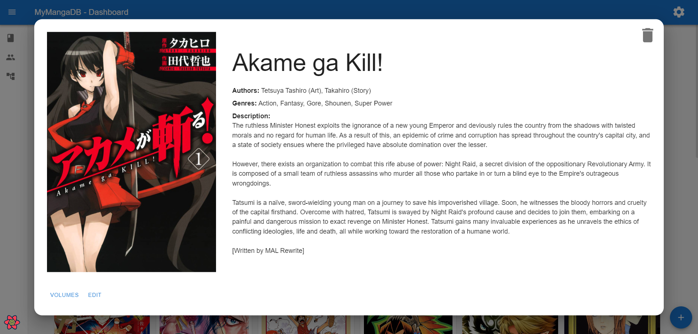

# MyMangaDB

**MyMangaDB** is the quintessential application for manga collectors. Say goodbye to spreadsheets and makeshift solutions. MyMangaDB offers a sleek, modern interface to manage your collection, automatically populating details like authors, genres, descriptions, and cover art.

## 🚀 Features

- **Automatic Metadata Fetching**: Simply enter a title, and MyMangaDB fetches all the details.
- **Collection Management**: Track what you own, what you've read, and what you plan to buy.
- **Role-Based Access Control (RBAC)**: Secure your database with Admin and Guest roles.
- **Responsive Design**: Manage your collection from your desktop or mobile device.
- **Docker Support**: Easy deployment with Docker and Traefik.

## 🤝 Data Providers

MyMangaDB relies on excellent external APIs to provide accurate manga data. A special thanks to:

- **[Manga Passion](https://manga-passion.de/)**: For comprehensive data on German manga releases.
- **[Jikan API](https://jikan.moe/)**: For extensive data on anime and manga (English/Global).

## 📸 Gallery

### Dashboard


### Manga Overview


### Editing Manga


### Automatic Fetching


## 🛠️ Installation & Deployment

### Docker (Recommended)

The easiest way to deploy MyMangaDB is using Docker. We provide a `docker-compose.yml` configured with Traefik for easy reverse proxying and SSL management.

1.  **Clone the Repository**
    ```bash
    git clone https://github.com/FabianRolfMatthiasNoll/MyMangaDB.git
    cd MyMangaDB
    ```

2.  **Configure Environment**
    Open `docker-compose.yml` and update the following:
    - **Traefik Labels**: Replace `<FrontendDomain>` and `<BackendDomain>` with your actual domains.
    - **Email**: Update `<MyEmail>` for Let's Encrypt SSL notifications.
    - **Environment Variables**:
        - `API_TOKEN`: Set this to a secure, random string.
        - `VITE_API_KEY`: Must match `API_TOKEN`.

3.  **Run the Application**
    ```bash
    docker-compose up -d
    ```

    Your application should now be accessible at your configured domains with HTTPS enabled.

### Local Home use

Just download the binaries from the latest release and use them. Available for linux and windows.

### Manual Installation (Development)

For contributors or those who prefer running without Docker.

**Prerequisites:**
- Python 3.12+
- Node.js 20+
- [Task](https://taskfile.dev/) (Taskfile runner)

1.  **Setup Environment**
    ```bash
    task setup
    ```
    This command creates virtual environments, installs dependencies, and generates `.env` files.

2.  **Run in Development Mode**
    ```bash
    task dev
    ```
    This starts both the FastAPI backend (port 8000) and Vite frontend (port 5173).

## 🔐 Authentication

MyMangaDB comes with pre-configured users. **Please change these passwords immediately after deployment.**

| Role | Username | Password | Access |
|------|----------|----------|--------|
| **Admin** | `admin` | `admin` | Full access (Create, Edit, Delete) |
| **Guest** | `guest` | `guest` | Read-only access |

## 🤝 Contributing

Contributions are welcome! Please follow these steps:

1.  Fork the repository.
2.  Create a feature branch (`git checkout -b feature/AmazingFeature`).
3.  Commit your changes (`git commit -m 'Add some AmazingFeature'`).
4.  Push to the branch (`git push origin feature/AmazingFeature`).
5.  Open a Pull Request.

## 📄 License

Distributed under the MIT License. See `LICENSE` for more information.
